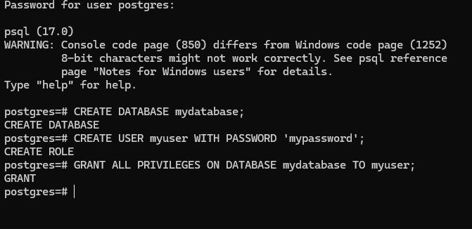

# Angular JavaScript Front End with Prisma database Backend and CI/CD Pipeline

This project outlines the process of setting up a **JavaScript-based Angular** front end with a **.NET Core backend**, including setting up CI/CD pipelines using **GitHub Actions**.

## Table of Contents
1. [Angular Frontend Setup](#angular-frontend-setup)
   - [Using Angular with JavaScript](#using-angular-with-javascript)
   - [Using Angular with TypeScript](#using-angular-with-typescript)
2. [.NET Core Backend Setup](#net-core-backend-setup)
3. [GitHub Setup](#github-setup)
4. [CI/CD Pipeline with GitHub Actions](#ci-cd-pipeline-with-github-actions)
5. [Testing and Deployment](#testing-and-deployment)
6. [Conclusion](#conclusion)

---

## Angular Frontend Setup

### Using Angular with JavaScript
We are writing the frontend code in **JavaScript** instead of TypeScript. Hence, we'll need to manually configure the folders and files.

#### Step-by-step Setup:

1. Install Angular CLI globally:
   ```bash
   npm install -g @angular/cli

   ```
2. Create a new Angular project:
   ```bash
   ng new simple-angular-devops

   ```
4. Install the needed dependencies
  ```bash
  npm install body-parser@^1.19.0 cors@^2.8.5 dotenv@^16.4.5 express@^4.17.1 path@^0.12.7 --save-dev nodemon@^2.0.7
  npm install prisma @prisma/client
  ```

 ```bash
ANGULARJS-REST-API/

│
├── client/
│   ├── components/
│   │   └── Carousel.html          # Bootstrap carousel component
│   ├── views/
│   │   ├── home.html              # Home page view
│   │   └── tasks.html             # Tasks page view
│   ├── app.js                     # Main AngularJS application logic
│   └── index.html                 # Entry point of the web app
│
├── models/                        # Backend models (Placeholder)
├── node_modules/                  # Node.js dependencies
├── .env                           # Environment variables (API URL, etc.)
├── package-lock.json              # Auto-generated dependency tree
├── package.json                   # Project dependencies and scripts
├── README.md                      # Project documentation (this file)
├── server.js                      # Node.js server setup
└── ...
 ```

 # Backend API Endpoints

For the task management feature, you should have a backend API that handles the following endpoints:

1. GET /get_tasks: Fetch all tasks.
1. POST /add_tasks: Add a new task.
1. POST /delete_tasks: Delete a task by ID.

# To just run the existing project 

1. Install the required dependencies
   ```bash
   npm i
   ```
2. Initialize the Node server
   ```bash
   npm start 
   ```

# Git commands 

1. init an empty git repo
   ```bash
   git init
   ```
2. create an .gitignore file soo we don't upload the .env and node modules
   ```bash
   # Ignore .env file
   .env
   #Ignore the node_modules directory
   node_modules/
   ```
3. Commit changes
   ```bash
   git commit -m "init files"
   ```
4. Add origin
    ```bash
    git remote add origin https://github.com/r0755466/angularjs-rest-api.git
    ```
5. push changes 
   ```bash
   git push -u origin master
   ```

# Configure CI/CD Pipeline

1. We add in github 
   ```bash
   git init
   ```

2. Configure the .github/workflows/ci.yml file

```bash
name: CI/CD Pipeline

on:
  push:
    branches:
      - master
  pull_request:
    branches:
      - master

jobs:
  test:
    runs-on: ubuntu-latest

    steps:
      # Checkout the repository
      - name: Checkout code
        uses: actions/checkout@v2

      # Set up Node.js
      - name: Setup Node.js
        uses: actions/setup-node@v2
        with:
          node-version: '16'

      # Install dependencies
      - name: Install Dependencies
        run: npm install

      # Run tests
      - name: Run Tests
        run: npm test -- --watch=false

  build:
    needs: test
    runs-on: ubuntu-latest

    steps:
      # Checkout the repository
      - name: Checkout code
        uses: actions/checkout@v2

      # Set up Node.js
      - name: Setup Node.js
        uses: actions/setup-node@v2
        with:
          node-version: '16'

      # Install dependencies
      - name: Install Dependencies
        run: npm install

      # Build the project
      - name: Build Angular app
        run: npm run build --prod

```


# Primsa database configuration 

1. We add the scheme 

```prisma
    datasource db {
    provider = "postgresql" // We can use Azure to test 
    url      = env("DATABASE_URL") // Ensure you have this in your .env file
}

generator client {
    provider = "prisma-client-js"
}

model Task {
    id        Int      @id @default(autoincrement())
    task      String
    createdAt DateTime @default(now())
    updatedAt DateTime @updatedAt
}

```

2. We add the Prisma scheme:
    We generate the table: 
```bash
    npx prisma generate
```

3. Using psql to test it

```bash
psql -U postgres -d mydatabase

-- Check privileges for myuser on public schema
SELECT
    nspname AS schema_name,
    usename AS user_name,
    has_schema_privilege(usename, nspname, 'USAGE') AS has_usage,
    has_schema_privilege(usename, nspname, 'CREATE') AS has_create
FROM
    pg_catalog.pg_user,
    pg_catalog.pg_namespace
WHERE
    nspname = 'public'
    AND usename = 'myuser';

-- Grant necessary permissions
GRANT USAGE ON SCHEMA public TO myuser;
GRANT CREATE ON SCHEMA public TO myuser;

```


# Doktorize the project 

...

# Debug commadns used

 curl -X POST http://localhost:5000/add_tasks -H "Content-Type: application/json" -d '{"task": "My new task"}'

